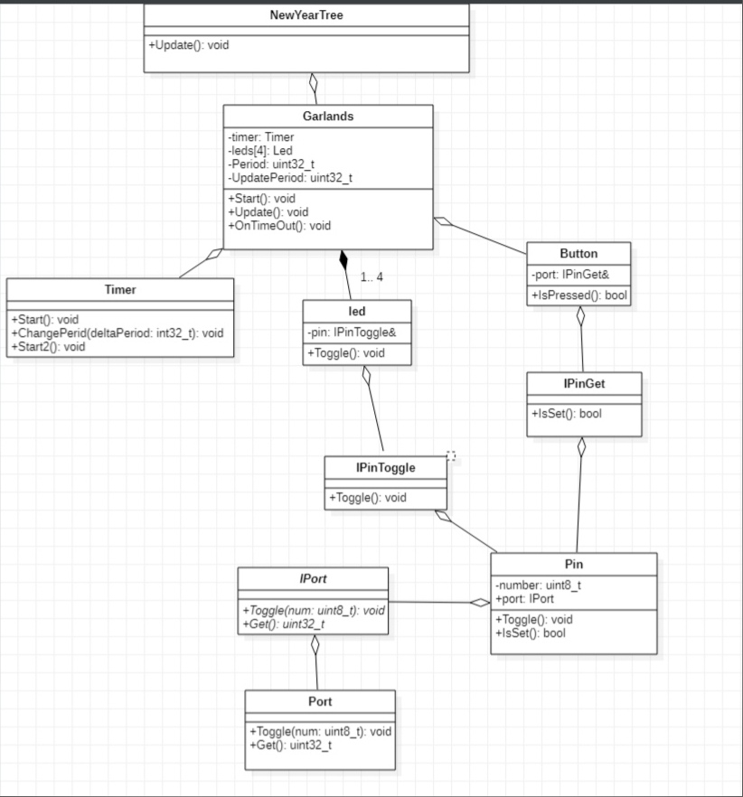
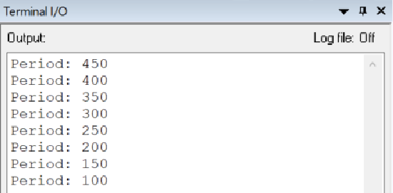

=== Новогодняя ёлка

*Задание:*

*Ход работы:*

Для построения архитектуры программы была использована программа _StarUML_, с её помощью было построено представленное ниже "древо" программы:

*Описание:*

_Port_ общается с _Pin_ через интерфейс _IPort_, который передает дальше методы _Get()_ и _Toggle()_.

Далее с _Pin_, с помощью интерфейсов _IPinToggle_ и _IPinGet_ обращаемся к _Led_ и _Button_, передаем дальше методы _Toggle()_ и _IsSet()_.

Далее архитектура переходит в _"Garlands.hpp"_ и получаем три метода: _"Start"_, _"Update"_ и _"OnTimeOut"_.

Самый верхний класс в архитектуре _NewYearTree_, который включает в себя ряд методов из других классов.

Программа может выводить значения измененного периода в терминал _IAR_:

*Код программы и классов представлены ниже:*

----
main.cpp

#include "gpiocregisters.hpp"
#include "gpioaregisters.hpp"
#include "rccregisters.hpp"
#include "nvicregisters.hpp"
#include <cstdint>
#include <iostream>
#include "port.hpp"
#include "pin.hpp"
#include "led.hpp"
#include "button.hpp"
#include "garlands.hpp"

#include "NewYaerTree.hpp"

extern "C"
{
int __low_level_init(void)
{
RCC::CR::HSEON::On::Set();
while (!RCC::CR::HSERDY::Ready::IsSet())
{}
RCC::CFGR::SW::Hse::Set();
while (!RCC::CFGR::SWS::Hse::IsSet())
{ }
RCC::CR::HSION::Off::Set();
RCC::AHB1ENR::GPIOCEN::Enable::Set();
RCC::AHB1ENR::GPIOAEN::Enable::Set();
GPIOC::MODER::MODER13::Input::Set();
GPIOC::MODER::MODER5::Output::Set();
GPIOA::MODER::MODER5::Output::Set();
GPIOC::MODER::MODER9::Output::Set();
GPIOC::MODER::MODER8::Output::Set();
return 1;
}
}
----
----
Button button(buttonPin);
Timer timer;
Garlands garlands(button);
NewYearTree newYearTree;
Pin buttonPin(13, PortC);//Кнопка
int main()
{
newYearTree.Update();
for(;;)
{}
return 0;
}
----
----
port.hpp

#include <cstdint>
#include <cassert>
#pragma once

class IPort
{
  public:
    virtual void Toggle(std::uint8_t num) = 0;
    virtual std::uint32_t Get() = 0;
};
template <typename Reg>
class Port:  public IPort
{
  public:
    void Toggle(std::uint8_t num) override
    {
      assert(num < 16);
      Reg::ODR::Toggle(1 << num);
    }
    std::uint32_t Get() override
    {
      return Reg::IDR::Get();
    }
};
----
----
port.hpp

#pragma once
#include "port.hpp"

class IPinToggle
{
  public:
    virtual void Toggle() = 0;
};

class IPinGet
{
  public:
      virtual bool IsSet() = 0;
};

class Pin: public IPinToggle, public IPinGet
{
public:
  Pin(std::uint8_t num, IPort& aPort): number(num),  port(aPort)
    {}
  void Toggle() override
  {
    port.Toggle(number);
  }

  bool IsSet() override
  {
    return ((port.Get() & (1 << number)) != 0U);
  }
private:
  std::uint8_t number;
  IPort& port;
};
----
----
led.hpp

#pragma once
#include "pin.hpp"

class Led
{
  public:
    Led(IPinToggle& aPin): pin(aPin)
    {}
    void Toggle()
    {
      pin.Toggle();
    }
  private:
     IPinToggle& pin;
};
----
----
button.hpp

#pragma once
#include "pin.hpp"

class Button
{
  public:
    Button(IPinGet& aButton): pin(aButton)
    {}
    bool IsPressed()
    {
      return (!pin.IsSet());
    }
  private:
     IPinGet& pin;
};
----
----
timer.hpp

#pragma once
#include "nvicregisters.hpp"
#include "tim5registers.hpp"
#include "gpiocregisters.hpp"
#include "gpioaregisters.hpp"
#include "rccregisters.hpp"
#include "tim2registers.hpp"

class Timer
{
  public:

    void Start(std::uint32_t Period)
    {
      RCC::APB1ENR::TIM5EN::Enable::Set();
      TIM5::PSC::Write(7999U);
      TIM5::ARR::Write(Period);
      TIM5::CNT::Write(0U);
      NVIC::ISER1::Write(1U << 18U);
      TIM5::DIER::UIE::Value1::Set();
      TIM5::SR::UIF::NoInterruptPending::Set();
      TIM5::CR1::CEN::Enable::Set();
    }
    void ChangePeriod(uint32_t UpdatePeriod)
    {
      TIM5::ARR::Write(UpdatePeriod);
      TIM5::CNT::Write(0U);
    }
    void Start2()
    {
      NVIC::ISER0::Write(1U << 28U);
      TIM2::CR1::URS::OverflowEvent::Set();
      RCC::APB1ENR::TIM2EN::Enable::Set();
      TIM2::PSC::Set(7999U);
      TIM2::ARR::Write(100U);
      TIM2::SR::UIF::NoInterruptPending::Set();
      TIM2::CNT::Write(0U);
      TIM2::DIER::UIE::Enable::Set();
      TIM2::CR1::CEN::Enable::Set();
    }
private:
  uint32_t Period;
};
----
----
garlands.hpp

#pragma once
#include <cstdint>
#include <cassert>
#include "led.hpp"
#include "button.hpp"
#include <array>
#include "pinscfg.h"
#include "timer.hpp"
#include <iostream>

extern Timer timer;
class Garlands
{
  public:
    Garlands(Button& aButton): button(aButton), leds{
                                                     Led(led1Pin),
                                                     Led(led2Pin),
                                                     Led(led3Pin),
                                                     Led(led4Pin)
                                                     }
    {
    }
     void Start()
    {
      timer.Start(Period);
      timer.Start2();
    }

    void Update()
    {
        if(button.IsPressed())
        {
        uint32_t CurrentPeriod = TIM5::ARR::Get();
        if(flag == 0)
        {
          UpdatePeriod = CurrentPeriod - 50U;
          if(UpdatePeriod == 50U)
          {
            flag = 1;
          }
        }
        else
        {
          UpdatePeriod = CurrentPeriod + 50U;
          if(UpdatePeriod == 500U)
          {
            flag = 0;
          }
        }
        timer.ChangePeriod(UpdatePeriod);
        std::cout <<"Ïåðèîä: " <<  UpdatePeriod << std::endl;
        }
    }
    void OnTimeOut()
    {
      leds[i++ & 0x3].Toggle();
    }

private:
   std::array<Led, 4> leds;
   Button& button;
   int i = 0;
   bool flag = 0;
   uint32_t Period = 500U;
   uint32_t UpdatePeriod;
};
----
----
NewYearTree.hpp

#pragma once
#include "garlands.hpp"

extern Garlands garlands;

class NewYearTree
{
  public:
    void Update()
    {
        garlands.Start();
    }
};
pinscfg.h

#pragma once
#include "port.hpp"
#include "pin.hpp"
#include "gpiocregisters.hpp"
#include "gpioaregisters.hpp"
#include "led.hpp"

inline Port<GPIOC> PortC;
inline Port<GPIOA> PortA;
inline Pin led1Pin(5, PortC);
inline Pin led2Pin(8, PortC);
inline Pin led3Pin(9, PortC);
inline Pin led4Pin(5, PortA);
----
